# 层次化图表征学习
## 问题背景
在社交网络中，节点会倾向于形成大小和范围不同的社区，这种社区结构本身揭示了网络的倾向性，同时社区本身也会以分层的方式组织起来。
## 挑战
对网络进行层次化的表征主要有以下的挑战，1. 如何构建层次化；2. 如何将层次化后的社区信息嵌入到网络节点的表征中；3. 使用何种方法衡量同层与不同层间的嵌入表征的影响

## Notation

|符号|含义|
|----|----|
|$G$|原始图|
|$A$|图G的邻接矩阵表示|
|$T$|通过某种方法将$G$层次化得到层次化社区树|
|c (Community)/S (subset)|T中的每个非叶子节点为一个社区|
|$c^l_i$|第l层的第i个社区|
|$pa(c)$|T中某一个节点c的父节点|
|$ch(c)$|T中某一个节点c的子节点|

------
## LouvainNE
<small>LouvainNE: Hierarchical Louvain Method for High Quality and Scalable Network Embedding</small>

### 核心思想及算法
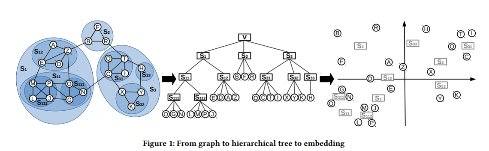
如上图所示，LouvainNE算法主要有以下三个过程组成：1.通过社区发现算法挖掘网络中的层次化关系；2.对每个层次分别进行表征学习；3.将不同层次的表征进行融合

### 1. 层次化构建：

本篇工作主要是通过Louvain算法，这种基于模块度社区发现算法，将图递归地划分出一个树形结构。
所谓的模块度就是：每一个社区的内部的边的权重之和减去所有与社区节点相连的边的权重之和。Louvain算法通过最大化模块度来进行划分，划分后，每个社区内的联系较为紧密，社区间的联系较为稀疏

具体的算法过程如下：
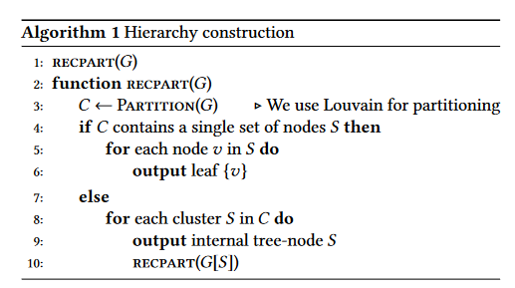

### 2. 生成每个层次的表征向量
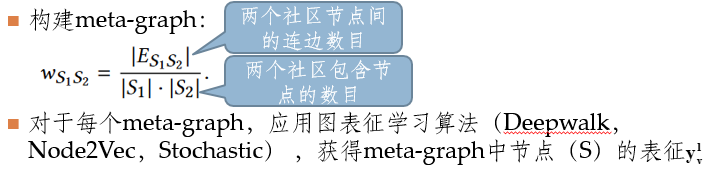

### 3. 融合不同层次的节点表征
在进行融合的时候应当尽量满足以下条件：邻居节点的关系应当被保留，在嵌入空间中，相似的节点之间的距离应当相近
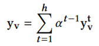
--------

## GNE
<small>Galaxy Network Embedding: A Hierarchical Community Structure Preserving Approach</small>

### 核心思想

尽可能保留同个社区内的本地的信息相似度（pairwise node similarity）
水平约束：同个社区内的节点的相似度应当比不同的社区之间的大
垂直约束：低层次的社区的相似度要比高层次的大

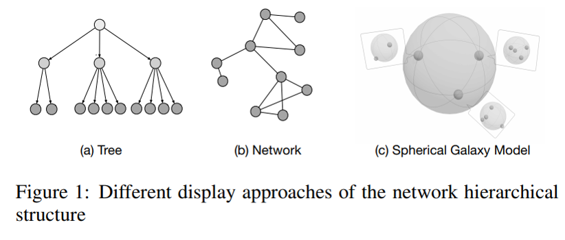

### 社区相似度
社区相似度的衡量方法：
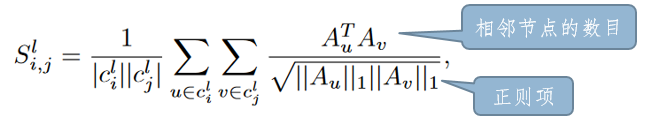

社区相似度的的优化目标：
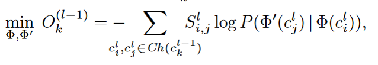
其中：
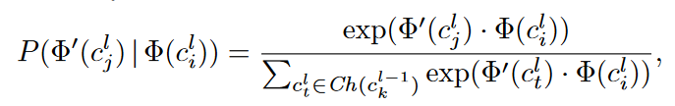

### 水平约束
属于同一个社区的节点应该比属于不同社区的节点更加接近
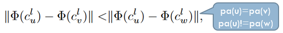

### 垂直约束
较浅的不同层之间的社区的内聚程度，应该小于较深层的社区的内聚程度。
这种垂直方向上的父子关系的社区约束可以表示为：

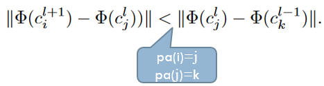

### GNE的优化目标
综合社区相似度以及水平约束和垂直约束，我们可以得到如下的这样一个优化目标：
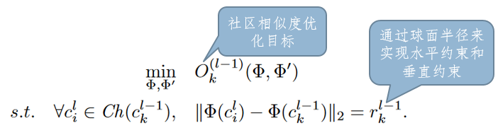
其中$r^(l-1)_(k)$为$l-1$层第$k$个社区的“球面半径”，计算方式如下：
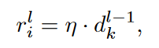
其中：
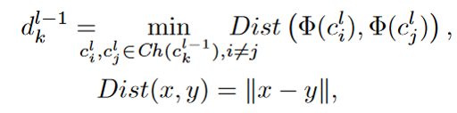
且超参数$\mu$小于1/6：使得学习到的表征，满足水平约束和垂直约束，证明方式见论文

### GNE算法的主要算法过程如下

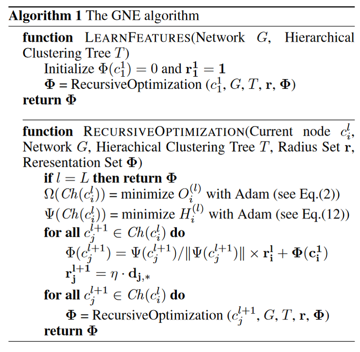